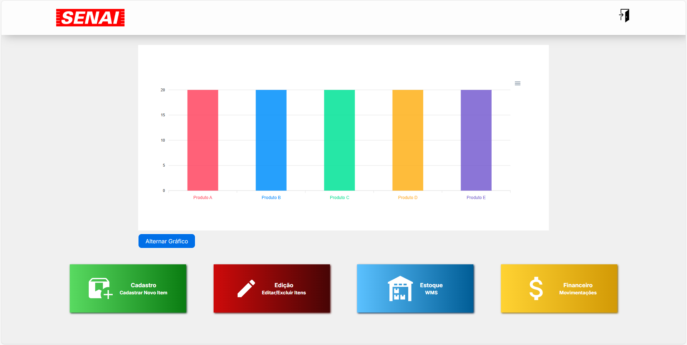

# WMS
Um sistema de WMS (Warehouse Management System)



> Um software que controla todas as operações de um armazém, desde a entrada até a saída de produtos. Ele otimiza processos, reduz erros e proporciona uma visão completa do estoque, auxiliando na tomada de decisões e na eficiência da logística.

### Ajustes e melhorias

O projeto ainda está em desenvolvimento e as próximas atualizações serão voltadas para as seguintes tarefas:

- [ ] Resposividade para tamanhos de telas diferentes
- [ ] Implementação do código em Pyton

## 💻 Pré-requisitos

Antes de começar, verifique se você atendeu aos seguintes requisitos:

- Ter instalado MSSQL;
- Node.js;
- Ter instalado todos os arquivos do WMS.

## 🚀 Instalando WMS

Para instalar o WMS, siga estas etapas:

1. No MSSQL restaure o banco de dados fornecido chamado WMS.bak;
2. Abra os arquivos do WMS no VS Code;
3. No terminal execute o seguinte comando:
```
node app.js
```
4. Abra o link fornecido após o comando ser executado.

## ☕ Funcionalidade

Para usar WMS:

<details>
  <summary> 🧑‍🎓 Área do Aluno</summary>

  <br>

   **📂 CADASTRO:**
   - Permite o cadastro de novos produtos no banco de dados através de um formulário simples e intuitivo.

  <br>

   **📝 EDIÇÃO:**
   - Possibilita a alteração das informações de produtos já cadastrados, mantendo seu estoque sempre atualizado.
   - Oferece a opção de excluir produtos, com uma camada de segurança extra: a necessidade da senha do professor para realizar essa ação.

 <br>

   **📊 ESTOQUE:**
   - Permite visualizar informações específicas dos produtos cadastrados, facilitando o acompanhamento do estoque.

  <br>
   
   **💰 FINANCEIRO:**
   <br>
    - Permite cadastrar entradas e saídas de produtos.
    <br>
    - Possibilita a visualização dos saldos, proporcionando controle financeiro do estoque.

</details>

## 🤝 Autores

Agradecemos às seguintes pessoas que contribuíram para este projeto:

<table>
  <tr>
    <td align="center">
      <a href="https://github.com/bruxa61">
        <sub>
          <b>Rafaela Botelho</b>
        </sub>
      </a>
    </td>
    <td align="center">
      <a href="https://github.com/cDorth">
        <sub>
          <b>Carlos Eduardo</b>
        </sub>
      </a>
    </td>
    <td align="center">
      <a href="https://github.com/pe-odake">
        <sub>
          <b>Pedro Odake</b>
        </sub>
      </a>
    </td>
    <td align="center">
      <a href="https://github.com/gprsilva">
        <sub>
          <b>Guilherme Pereira</b>
        </sub>
      </a>
    </td>
    <td align="center">
      <a href="https://github.com/brubsb">
        <sub>
          <b>Bruna Barboza</b>
        </sub>
      </a>
    </td>
    <td align="center">
      <a href="https://github.com/DaviTorralvo">
        <sub>
          <b>Davi Torralvo</b>
        </sub>
      </a>
    </td>
    <td align="center">
      <a href="https://github.com/Rai123100">
        <sub>
          <b>Raí Carvalho</b>
        </sub>
      </a>
    </td>
    <td align="center">
      <a href="https://github.com/intentdoor">
        <sub>
          <b>Arthur Américo</b>
        </sub>
      </a>
    </td>
    <td align="center">
      <a href="https://github.com/vicenteruedamatheus">
        <sub>
          <b>Matheus Vicente</b>
        </sub>
      </a>
    </td>
  </tr>
</table>
